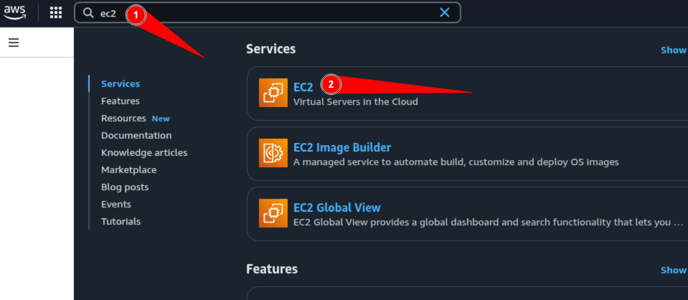
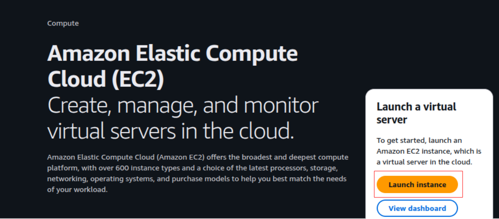
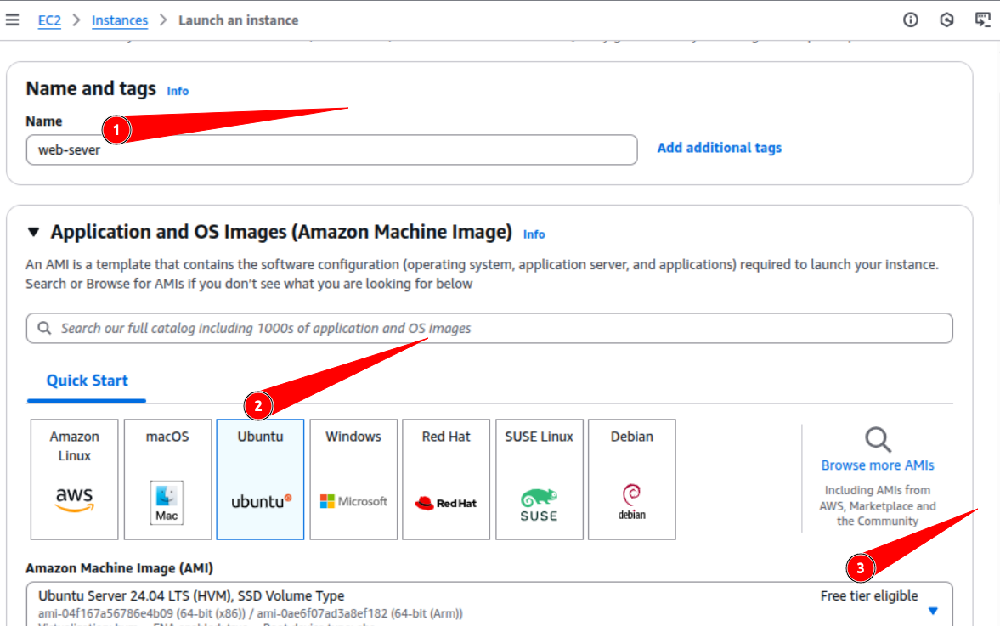
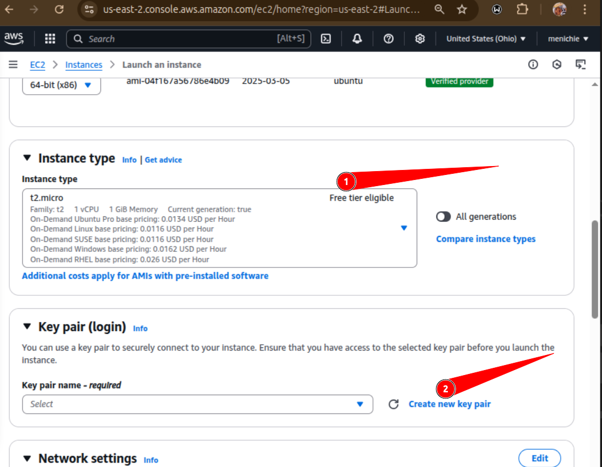
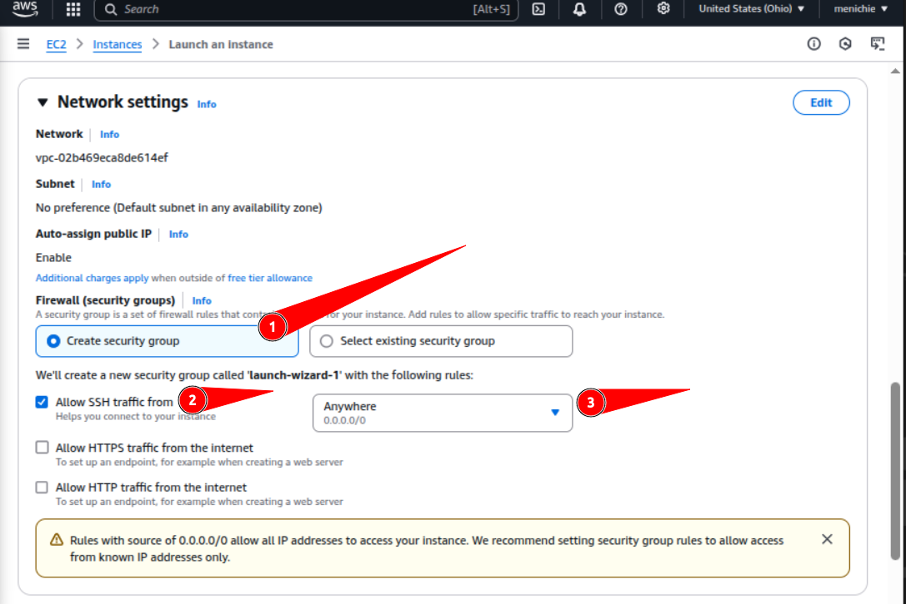
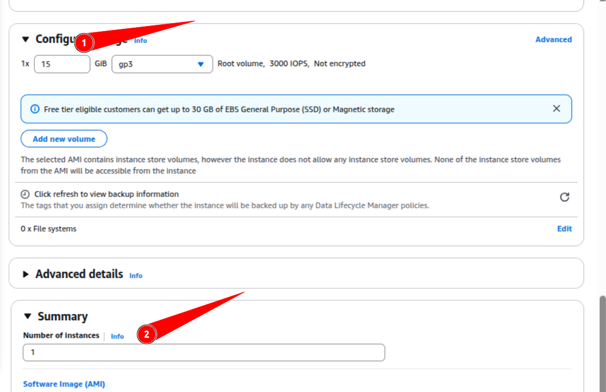
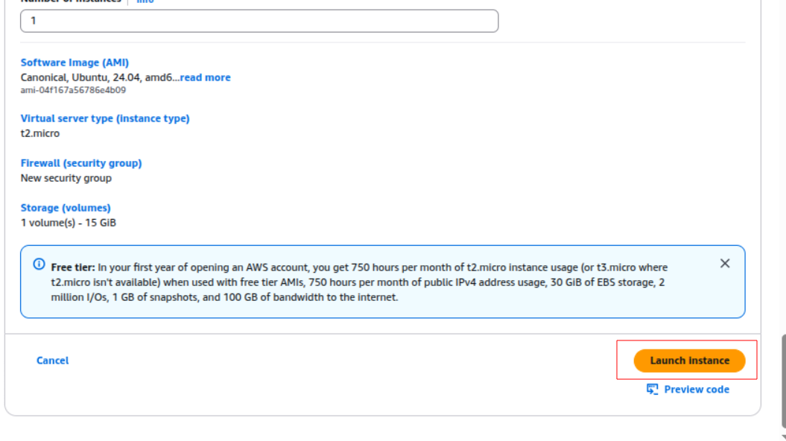
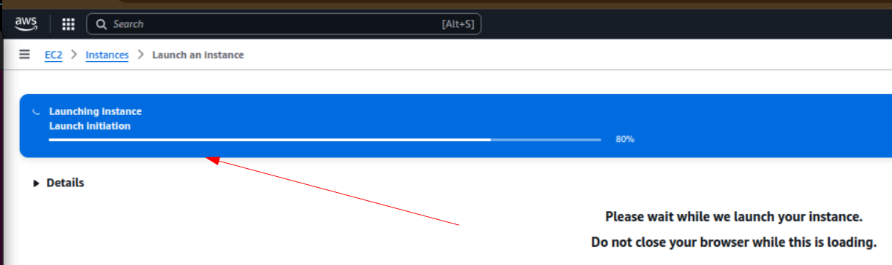
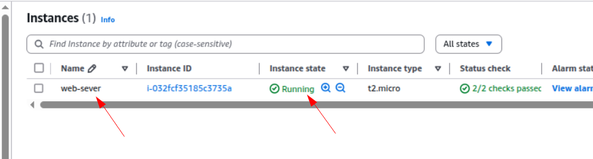
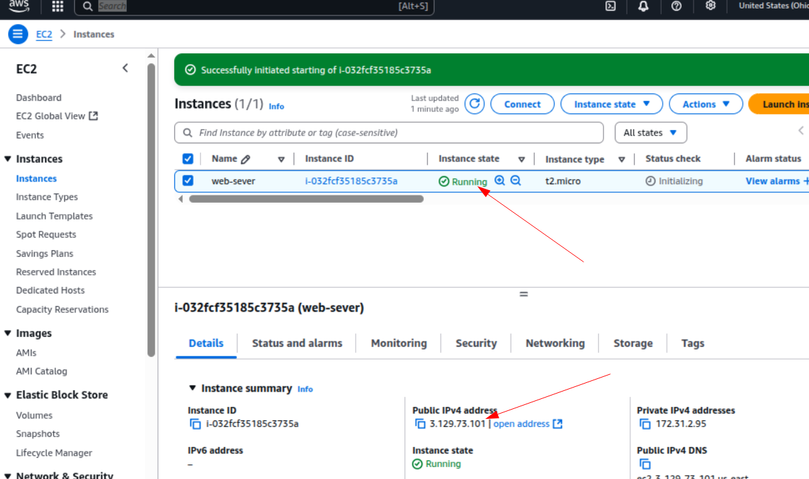

# mini-project-linux
## This project demonstrates how to create an Elastic Compute Cloud (EC2) instance.

* ### Go to [aws website](https://signin.aws.amazon.com/signup?request_type=register) and create an account if not already.
* Login to the account you just created
* On the search bar, tpye **EC2** and click on th first option **EC2 Virtual Servers in the Cloud**

* On the next page click *Launch instance* 

## Filling out EC2 instance details
* Fill the name of your server
* Select ubuntu for OS image type
* Make sure it is _free tier eligible_
 

* Select instance type _t2 micro_ and confirm it is _free tier eligible_

* Type your key-pair name, _RSA_ for key pair type and _.pem_ for key pair format and click **Create key pair**
 

### Key pair will automatically download to your local computer.

* Create a Secuirity groupm be sure to check _Allow ssh traffic_ and from any IP address

* Next, Increase the storage size to 15gb, specify the number of instances you want to create

* Click _Launch instance_ to create the Ec2 VM on AWS

* You should see the VM building.

* Once ready, go to your dashboard to see the VMs running on your account.

## Connecting to the instance(ssh)
* Find the public IP address of the running instance

