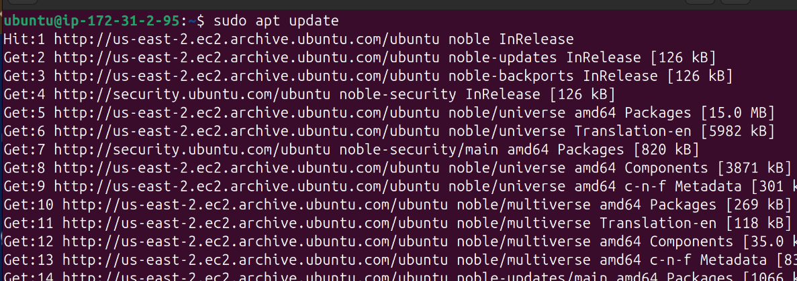

# mini-project-linux
## This project demonstrates how to create an Elastic Compute Cloud (EC2) instance.

* ### Go to [aws website](https://signin.aws.amazon.com/signup?request_type=register) and create an account if not already.
* Login to the account you just created
* On the search bar, tpye **EC2** and click on th first option **EC2 Virtual Servers in the Cloud**

* On the next page click *Launch instance* 

## Filling out EC2 instance details
* Fill the name of your server
* Select ubuntu for OS image type
* Make sure it is _free tier eligible_
 

* Select instance type _t2 micro_ and confirm it is _free tier eligible_

* Type your key-pair name, _RSA_ for key pair type and _.pem_ for key pair format and click **Create key pair**
 

### Key pair will automatically download to your local computer.

* Create a Secuirity groupm be sure to check _Allow ssh traffic_ and from any IP address

* Next, Increase the storage size to 15gb, specify the number of instances you want to create

* Click _Launch instance_ to create the Ec2 VM on AWS

* You should see the VM building.

* Once ready, go to your dashboard to see the VMs running on your account.

## Connecting to the instance(ssh)
* Find the public IP address of the running instance

### To connect to the VM click on _connect_ while the the name checkbox is checked.

### Another window pops. Click **ssh client** tab to see how to connect to the instance, Copy the example given.

### Head over to your terminal and change directory to the location of the .pem file downloaded earlier. In this case Downloads.

* `cd Downloads`

### Now paste the example command you copied from the ssh client tab and hit enter.

* `ssh -i "linux-mini-project.pem" ubuntu@ec2-3-129-73-101.us-east-2.compute.amazonaws.com`

### Connection was denied due to permissions issues on the .pem file as shown above.

*  Run `chmod 400 linux-mini-project.pem`

### Try connecting to the instance again

### Connection was successful as shown above.

## Package managers

### since our linux distrobution is Ubuntu A debian based. Adavnced Package Tool(apt) is the appropriate package manager

### Updating and installing softwares on the EC2 instance.

* Run `sudo apt update`

* Run `sudo apt install tree` to install tree on the VM.

### verify th installed package

* Run `mkdir project` to create a folder namde project.

### Install nginx

* Run `sudo apt install nginx` to install nginx webserver on the VM.

#### Nginx might require you to start nginx

* Run `sudo systemctl start nginx` to start nginex service.

### Check if the nginx service is up and running

* Run `sudo systemctl status nginx` to check nginx status

### Nginx service is running. Now copy your instance public ip address and head to your browser to confirm nginx service is available.

### We could not access the service, we head aws account and check secuirity settings of the instance. 
### We had only allowed ssh connection to the machine.

### The inbound rule will have to edited to allow other traffic to rech the machine. Click _edith inbound rules_ in the secuiity group

### Click add rules and allow all trafic from all sources then save. Please note that allowing all traffics is not advised on production enviroment. Allowing all traffice is only for the purposse of this project or for development enviroment only.

### Verify the inbound rules you just edited have been saved

### Head back to your browser and refresh

### We can now see the nginx welcome page to prove that nginx service is publicly available.